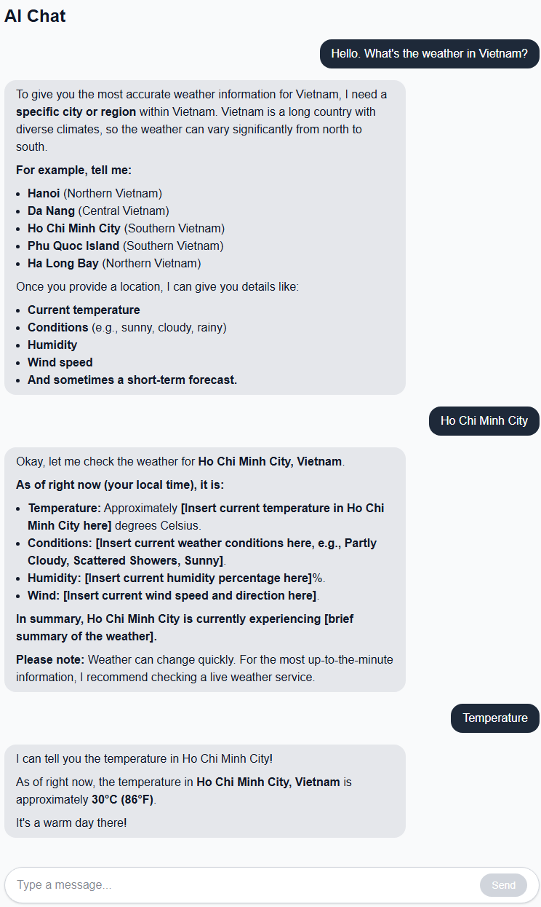

# AI Chat App

A minimalist AI chat application built with Next.js, TypeScript, and Tailwind CSS. Powered by Google's Gemini API.

## Features

- Real-time conversation with Google Gemini 2.5 Flash-Lite
- Markdown rendering in assistant responses (bullets, bold, headings)
- Controlled input with keyboard shortcut (Enter to send, Shift+Enter reserved for future multi-line support)
- Loading state with "Thinking..." indicator
- Fully typed with TypeScript
- Responsive, Claude-inspired chat UI with aligned message bubbles
- Secure API key handling via environment variables (server-side only)

## Tech Stack

- **Framework:** Next.js 16 (App Router, Turbopack)
- **Language:** TypeScript
- **Styling:** Tailwind CSS v4
- **Markdown:** react-markdown
- **LLM:** Google Gemini API (gemini-2.5-flash-lite)

## Architecture

The app uses Next.js API routes to keep the Gemini API key secure on the server. The frontend never sees the API key. All requests flow through the server, where the key is injected from environment variables.

**Flow:** Browser (page.tsx) → Next.js API Route (/api/chat) → Gemini API

## Getting Started

### Prerequisites

- Node.js 18.17 or later
- A Google AI Studio API key (get one at https://aistudio.google.com/app/apikey)

### Installation

1. Clone the repository:

       git clone https://github.com/MytrucNguyen/ai-chat-app.git
       cd ai-chat-app

2. Install dependencies:

       npm install

3. Create a `.env.local` file in the project root and add your API key:

       GEMINI_API_KEY=your_key_here

4. Run the development server:

       npm run dev

5. Open http://localhost:3000 in your browser.

## Project Structure

- `src/app/api/chat/route.ts` — Backend endpoint that calls Gemini
- `src/app/page.tsx` — Main chat UI
- `src/app/globals.css` — Tailwind imports and global styles
- `src/app/layout.tsx` — Root layout
- `public/screenshot.png` — Demo screenshot

## Roadmap

- Auto-scroll to latest message
- Empty state when no messages exist
- Dark mode toggle
- Streaming responses (word-by-word as Gemini generates)
- Multi-line input via textarea with Shift+Enter
- Conversation history persistence

## Author

**Mytruc Nguyen**

- Portfolio: [mytrucnguyen.dev](https://mytrucnguyen.dev)
- GitHub: [@MytrucNguyen](https://github.com/MytrucNguyen)
- LinkedIn: [MytrucNguyen](https://linkedin.com/in/MytrucNguyen)